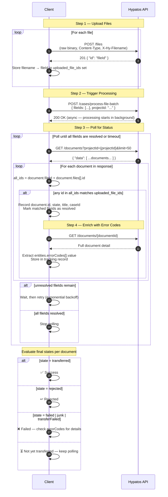

# File Batch Processing — Integration Guide

## Overview

This guide describes how to upload files, trigger batch processing, and track the outcome of each document using the Hypatos API.

There are four steps:

1. **Upload** — each file is uploaded individually and a `fileId` is returned
2. **Process** — all `fileId`s are submitted together as a batch to a specific project
3. **Track** — the resulting documents are polled by `projectId` and matched against uploaded fileIds
4. **Enrich** — once a document is matched, fetch its full detail to collect `entities.errorCodes`

---

## Important: Files vs Documents

Multiple uploaded files can be **merged into a single document** by the API. For example, uploading an invoice PDF and a portal invoice XML may produce one document containing both as entries in its `files` array.

```
Upload 2 files  →  1 document created

fileId A  ──┐
            ├──▶  document { fileId: A,  files: [{id: A, mainFile: true}, {id: B, mainFile: false}] }
fileId B  ──┘
```

Because of this, **do not track by querying `GET /documents?fileId={id}` per file** — this only matches the top-level `fileId` field (the main file) and will miss non-main files.

Instead, query by `projectId` and match against **both** the top-level `fileId` and every entry in `document.files[].id`.

---

## API Endpoints

| Step | Method | Endpoint | Purpose |
|---|---|---|---|
| Upload | `POST` | `/files` | Upload a single file, returns `fileId` |
| Process | `POST` | `/cases/process-file-batch` | Submit fileIds to a project for processing |
| Track | `GET` | `/documents?projectId={id}` | List documents for a project to match against uploaded fileIds |
| Enrich | `GET` | `/documents/{id}` | Fetch full document detail including `entities.errorCodes` |

> **Why two document calls?** The list endpoint (`GET /documents`) returns a lightweight representation that does not include `entities`. The `entities.errorCodes` field is only available in the full detail response from `GET /documents/{id}`.

### Authentication

All requests require an OAuth 2.0 Bearer token obtained via:

```
POST /auth/token
Content-Type: application/x-www-form-urlencoded

grant_type=client_credentials
```

Use HTTP Basic Auth with `client_id` and `client_secret`. The response returns an `access_token` to be used as `Authorization: Bearer <token>`.

---

## Step 1 — Upload Files

Upload each file individually. Send the raw file bytes as the request body.

```
POST /files
Authorization: Bearer <token>
Content-Type: application/pdf          ← set to the actual MIME type of the file
X-Hy-Filename: invoice.pdf            ← optional but recommended
```

**Supported MIME types:** `application/pdf`, `image/jpeg`, `image/png`, `image/tiff`, `application/xml`

**Response (201):**
```json
{
  "id": "9f943413-c1a1-43c1-b678-0439d234cabe"
}
```

Store each returned `id` as a `fileId` and keep the mapping to the original filename.

---

## Step 2 — Process File Batch

Once all files are uploaded, submit them together to a project.

```
POST /cases/process-file-batch
Authorization: Bearer <token>
Content-Type: application/json
```

```json
{
  "fileIds": [
    "9f943413-c1a1-43c1-b678-0439d234cabe",
    "360d672d-c6e7-4539-b897-79c99f712aa4"
  ],
  "projectId": "69e1e5cf0707eff1ad8b5dbb"
}
```

Processing is **asynchronous** — the API accepts the request immediately but the documents are created and processed in the background.

---

## Step 3 — Track Document Status

### Why not query by fileId directly?

`GET /documents?fileId={id}` only matches the top-level `fileId` field, which is the **main file** of a document. If your file was merged as a non-main attachment, it will not appear in this query.

### Correct approach: query by projectId, match all fileIds

Query documents for the project and check whether any of your uploaded fileIds appears in either:
- `document.fileId` (top-level, main file), **or**
- any `id` inside `document.files[]`

```
GET /documents?projectId=69e1e5cf0707eff1ad8b5dbb&limit=50
Authorization: Bearer <token>
```

**Matching logic (pseudocode):**
```
uploaded_file_ids = { "9f943413...", "360d672d...", "6eb84ff7..." }

for each document in response.data:
    all_ids_in_doc = { document.fileId } ∪ { f.id for f in document.files }

    if all_ids_in_doc ∩ uploaded_file_ids is not empty:
        → this document belongs to our batch
        → record document.id, document.state, document.title, document.caseId
```

**Example response entry:**
```json
{
  "id": "6a15b6ed988f9acd1d84091d",
  "projectId": "69e1e5cf0707eff1ad8b5dbb",
  "fileId": "21ef4211-a0b3-480d-b634-bcd0f792712f",
  "caseId": "019e64d2-86e1-7735-8792-55bcbfd5f993",
  "title": "Supplier_invoice_from_Dussmann_Austria_GmbH_...",
  "state": "done",
  "files": [
    { "id": "21ef4211-a0b3-480d-b634-bcd0f792712f", "type": "invoice",    "mainFile": true  },
    { "id": "40e1d2bc-4aff-4e98-9d48-d2ea63d7682f", "type": "attachment", "mainFile": false },
    { "id": "6eb84ff7-87aa-44b3-801e-f1d4247e0420", "type": "attachment", "mainFile": false }
  ]
}
```

Here, uploading 3 files produced 1 document. Querying `?fileId=40e1d2bc...` would have returned nothing — only the intersection approach finds it.

---

## Step 4 — Enrich with Error Codes

Once a document is matched in Step 3, fetch its full detail to retrieve `entities.errorCodes`. This field is **not available** in the list response.

```
GET /documents/6a15b6ed988f9acd1d84091d
Authorization: Bearer <token>
```

The relevant part of the response:

```json
{
  "id": "6a15b6ed988f9acd1d84091d",
  "state": "transferFailed",
  "entities": {
    "errorCodes": [
      { "value": "E04 - Missing Time of Supply" },
      { "value": "E05 - Currency Missing" },
      { "value": "E07 - Sender Data Missing" },
      { "value": "E18 - Gross Total Missing" },
      { "value": "W17 - BCA mismatch" }
    ]
  }
}
```

Extract the `value` string from each entry in `entities.errorCodes`. If the field is absent or the array is empty, record an empty list.

**Extraction logic (pseudocode):**
```
detail = GET /documents/{documentId}
error_codes = [ e["value"] for e in detail.entities.errorCodes ]
             if detail.entities and detail.entities.errorCodes
             else []
```

> **When to call this:** Fetch the detail as soon as the document is first matched (Step 3), and again whenever the state changes, as error codes may be added or updated during processing.

---

## Document States

| State | Category | Meaning |
|---|---|---|
| `transferred` | ✅ Success | Document successfully transferred to the target system |
| `done` | ⏳ Not Yet Transferred | Processed and confirmed, awaiting transfer |
| `doneAutomatically` | ⏳ Not Yet Transferred | Auto-confirmed, awaiting transfer |
| `extracted` | ⏳ Not Yet Transferred | Data extracted, awaiting confirmation |
| `inCompletion` | ⏳ Not Yet Transferred | Completion in progress |
| `new` | ⏳ Not Yet Transferred | Document received, not yet processed |
| `reviewRequired` | ⏳ Not Yet Transferred | Flagged for manual review |
| `processing` | ⏳ Not Yet Transferred | Currently being processed |
| `split` | ⏳ Not Yet Transferred | Document is being split into multiple documents |
| `failed` | ❌ Failed | Processing failed |
| `junk` | ❌ Failed | Document identified as junk/unprocessable |
| `transferFailed` | ❌ Failed | Transfer to target system failed |
| `rejected` | ↩️ Rejected | Document was rejected and returned to supplier |

> **Terminal states** (no further changes expected): `transferred`, `failed`, `junk`, `transferFailed`, `rejected`

---

## End-to-End Flow



---

## Tracking Data Model

Track at the **document** level, not the file level. One document may correspond to multiple uploaded files.

```json
{
  "documentId": "6a15b6ed988f9acd1d84091d",
  "title": "Supplier_invoice_from_Dussmann_Austria_GmbH_...",
  "caseId": "019e64d2-86e1-7735-8792-55bcbfd5f993",
  "state": "transferFailed",
  "category": "failed",
  "errorCodes": [
    "E04 - Missing Time of Supply",
    "E05 - Currency Missing",
    "E07 - Sender Data Missing",
    "E18 - Gross Total Missing",
    "W17 - BCA mismatch"
  ],
  "matchedFiles": [
    { "filename": "invoice.pdf",     "fileId": "21ef4211-...", "mainFile": true  },
    { "filename": "attachment1.pdf", "fileId": "40e1d2bc-...", "mainFile": false },
    { "filename": "attachment2.xml", "fileId": "6eb84ff7-...", "mainFile": false }
  ]
}
```

| Field | Source | Notes |
|---|---|---|
| `documentId` | `GET /documents` list | Matched via fileId intersection |
| `title` | `GET /documents` list | Human-readable document title |
| `caseId` | `GET /documents` list | Links to the case in the platform |
| `state` | `GET /documents` list | Re-fetched on each poll cycle |
| `category` | Derived | success / not-yet-transferred / failed / rejected |
| `errorCodes` | `GET /documents/{id}` | Extracted from `entities.errorCodes[].value` |
| `matchedFiles` | Upload step + list match | Maps filenames to their fileIds |

---

## Polling Recommendations

- Start polling after a short initial delay (e.g. 5–10 seconds) to allow processing to begin
- Use exponential backoff if no new documents are matched: 5s → 10s → 20s → 30s (cap at 30s)
- Paginate if the project has many documents: increment `offset` until `data` is empty or all fileIds are resolved
- Stop polling a document once it reaches a **terminal state**: `transferred`, `rejected`, `failed`, `junk`, or `transferFailed`
- Re-fetch `GET /documents/{id}` on each poll cycle for non-terminal documents — `errorCodes` may be updated as processing progresses
- Set a maximum polling duration (e.g. 10 minutes) and mark as `timeout` if no terminal state is reached
