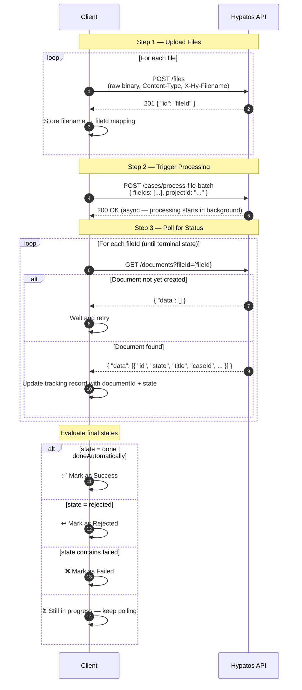

# File Batch Processing — Integration Guide

## Overview

This guide describes how to upload files, trigger batch processing, and track the outcome of each document using the Hypatos API.

There are three steps:

1. **Upload** — each file is uploaded individually and a `fileId` is returned
2. **Process** — all `fileId`s are submitted together as a batch to a specific project
3. **Track** — the resulting documents are polled by `fileId` to monitor their processing state

---

## API Endpoints

| Step | Method | Endpoint | Purpose |
|---|---|---|---|
| Upload | `POST` | `/files` | Upload a single file, returns `fileId` |
| Process | `POST` | `/cases/process-file-batch` | Submit fileIds to a project for processing |
| Track | `GET` | `/documents?fileId={fileId}` | Look up the document created from a file |
| Detail | `GET` | `/documents/{id}` | Get full document details by document ID |

### Authentication

All requests require an OAuth 2.0 Bearer token obtained via:

```
POST /auth/token
Content-Type: application/x-www-form-urlencoded

grant_type=client_credentials
```

Use HTTP Basic Auth with `client_id` and `client_secret`. The response returns an `access_token` to be used as `Authorization: Bearer <token>`.

---

## Step 1 — Upload Files

Upload each file individually. Send the raw file bytes as the request body.

```
POST /files
Authorization: Bearer <token>
Content-Type: application/pdf          ← set to the actual MIME type of the file
X-Hy-Filename: invoice.pdf            ← optional but recommended
```

**Supported MIME types:** `application/pdf`, `image/jpeg`, `image/png`, `image/tiff`, `application/xml`

**Response (201):**
```json
{
  "id": "9f943413-c1a1-43c1-b678-0439d234cabe"
}
```

Store each returned `id` as a `fileId` and keep the mapping to the original filename.

---

## Step 2 — Process File Batch

Once all files are uploaded, submit them together to a project.

```
POST /cases/process-file-batch
Authorization: Bearer <token>
Content-Type: application/json
```

```json
{
  "fileIds": [
    "9f943413-c1a1-43c1-b678-0439d234cabe",
    "360d672d-c6e7-4539-b897-79c99f712aa4"
  ],
  "projectId": "69e1e5cf0707eff1ad8b5dbb"
}
```

Processing is **asynchronous** — the API accepts the request immediately but the documents are created and processed in the background.

---

## Step 3 — Track Document Status

Poll the documents list endpoint using the `fileId` to find the document created from each uploaded file.

```
GET /documents?fileId=9f943413-c1a1-43c1-b678-0439d234cabe
Authorization: Bearer <token>
```

**Response:**
```json
{
  "data": [
    {
      "id": "6a18492144ae241453d0e15a",
      "projectId": "69e1e5cf0707eff1ad8b5dbb",
      "fileId": "9f943413-c1a1-43c1-b678-0439d234cabe",
      "caseId": "019e6edd-a989-784f-98c6-7c24765b605e",
      "title": "Supplier_invoice_from_Glacis_Beisl_...",
      "state": "done",
      "files": [
        { "id": "9f943413-c1a1-43c1-b678-0439d234cabe", "type": "invoice", "mainFile": true },
        { "id": "360d672d-c6e7-4539-b897-79c99f712aa4", "type": "portalinvoice", "mainFile": false }
      ]
    }
  ]
}
```

If `data` is empty, the document has not been created yet — retry after a short delay.

---

## Document States

| State | Category | Meaning |
|---|---|---|
| `done` | ✅ Success | Document processed and confirmed |
| `doneAutomatically` | ✅ Success | Document processed and auto-confirmed |
| `rejected` | ↩️ Rejected | Document was rejected and returned to supplier |
| `failed` | ❌ Failed | Processing failed |
| `failedRetrying` | ❌ Failed | Processing failed, retry in progress |
| `extracted` | ⏳ In Progress | Data extracted, awaiting confirmation |
| `processing` | ⏳ In Progress | Currently being processed |
| `waitingForConfirmation` | ⏳ In Progress | Awaiting human review in Studio |

> **Terminal states** (no further changes expected): `done`, `doneAutomatically`, `rejected`, `failed`

---

## End-to-End Flow



---

## Tracking Data Model

Maintain a record per uploaded file throughout the lifecycle:

```json
{
  "filename": "invoice.pdf",
  "fileId": "9f943413-c1a1-43c1-b678-0439d234cabe",
  "documentId": "6a18492144ae241453d0e15a",
  "title": "Supplier_invoice_from_Glacis_Beisl_...",
  "caseId": "019e6edd-a989-784f-98c6-7c24765b605e",
  "state": "done",
  "category": "success"
}
```

`documentId`, `title`, `caseId`, `state`, and `category` are populated after the first successful poll in Step 3. `fileId` and `filename` are set at upload time.

---

## Polling Recommendations

- Start polling after a short initial delay (e.g. 5–10 seconds) to allow processing to begin
- Use exponential backoff if `data` is still empty: 5s → 10s → 20s → 30s (cap at 30s)
- Stop polling once the document reaches a **terminal state**: `done`, `doneAutomatically`, `rejected`, or any `failed*` state
- Set a maximum polling duration (e.g. 10 minutes) and mark as `timeout` if no terminal state is reached
